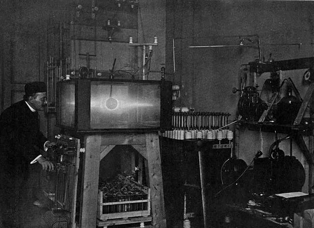

# Death of Professor Birkeland

## written by [Torahiko Terada](https://www.aozora.gr.jp/cards/000042/files/2515_10279.html), published in July 1935

Once a year, when the season of green leaves is over,
and when the leaves gradually turn dark in warm and gloomy rains, 
I certainly remember professor B, a physicist from Scandinavia, 
who died abroad at the hotel S in Tokyo more than ten years ago.
But my remembrance gets fainter because it was quite a long time ago.
As I repeat remembering it over and over, 
a lot of fictions are mixed unconsciously,
and are merged with facts completely but unintentionally.
So now I cannot discern the boundary between these facts and fictions.
Thus it is like a kind of novel, or it is rather like a nightmare
which has been rehashed again and again for many years.
I tried to write a record about it several times so far.
But whenever I felt something that prevented my pen from trying,
I left it unwritten. On the other side of my mind, I feel worse
if I don't write anything brief about it for the rest of my life.
So here I shall write down its outline in the form of a memorandum, 
as objectively as possible, before my scarce memories of facts fade away.

Perhaps it was early in May near the end of World War One.
One morning I went into the office of the college R which
I worked in at the time. There I saw an old, bald, and short stranger 
from the West, who was talking with a clerk.
The clerk showed me a business card of the Westerner, and said to me that 
this gentleman wanted to use the library in the department of physics.
The clerk asked me what to do. 
Looking at the card, I realized that this gentleman was professor B, 
a famous physicist from the university K in Norway,
who studied about atmospheric-nitrogen fixation,
and also about northern lights.
Once I not only had met the professor in Norway, but I also
had visited his laboratory to see his famous experiment of 
the vacuum discharge that simulated northern lights.
Moreover, I had ever been invited to his private residence for tea.
So I could soon recognize him by the same face as I saw before.
But he didn't seem to remember me clearly.

Professor B came to our library and searched for a book,
which was a report about an expedition for observing northern lights.
He was an organizer of the expedition.
Unfortunately our department didn't own the book then,
and he looked badly disappointed.

Anyway, a rare guest from a remote country visited
our department really unexpectedly.
So I soon informed the chief professor N and the emeritus professor T
about his visit, and introduced the guest to them.
Of course they both were surprised and delighted by 
the totally unexpected visit of this erudite scholar.
However, professor B was somehow dispirited, and looked
very tired of making contact with people.

A few days later, I received a letter from professor B who
stayed in a hotel in Hakone. In the letter, he asked me
to search for a quiet hotel in Tokyo, because
he suffered from insomnia, as I recall.
At that time there was the hotel S affiliated to the palace S 
near the Park of Ueno. I thought that the hotel S was somewhat 
quieter than those in the middle of Tokyo, so I suggested 
that he move to the hotel S. 
Soon he did so and, fortunately, looked satisfied with the quiet place.

After that, he occasionally visited my office in the department of physics.
At that time I was studying about the sudden changes of geomagnetic fields,
and professor B was studying about the motion of charged particles
in the upper atmosphere. 
We talked a lot about the relation among our studies.
But the more times we met, the more clearly I noticed that 
professor B was badly depressed and emaciated.
Although he was fairly fat, he looked pale and lacked vitality.
I perceived some dark shadow behind his gray eyes.

One day in heavy rain, when he visited me at about noon, 
he wore a raincoat, made of thin silk and rubber,
that looked like wings of cicada.
Weather was so muggy that drops of sweat streamed down 
on his broad and bald forehead, and he talked as he
wiped the sweat with his handkerchief.
His gray and fine hairs sparsely stood on end, 
and it looked as if steam was rising. 
This time only, he had a healthy and rosy countenance,
and his eyes looked shining alive.
Somehow I still have a clear impression of this countenance.

When he invited me for lunch in the hotel S, 
he joked comically with no regard to science, 
though I forgot what he said. Then I saw his unusual smiles too.

One day he told me to come to his room, because he wanted me 
to hear his long talk. When I came there, he was in nightclothes
and was lying on the bed. He said that
he would talk while lying in bed, because he felt ill slightly.
Then he asked me if I would hear him speak French, because
speaking German or English was a painful burden for him on that day.
I said that French was hardest for me to hear, but that
I could understand a rough outline if he would speak very slowly.
He said OK and began speaking bit by bit.
The contents of his talk were really out of my anticipation.

As far as I could understand, his talk would roughly be 
summarized as follows. But looking back now, I don't have
any means to check as to how much I misheard or wrongly remember.

Motivated by World War One, professor B got an idea
of inventing some important instruments for military use.
He first recommended using the instruments to French government,
but the government turned down the recommendation.
Next he went to another country X and made a similar proposal.
The government X showed an interest in the details of the invention,
even performed some experiments, but refused the proposal in the end.
But somehow a spy from the country X followed professor B 
like a shadow since then. 
Professor B said that he sensed the shadow on his part.
After that, he went to the Helwan observatory in Africa,
in order to get data for his research, and also
in order to get away from the shadow that chased him.
When he observed the zodiacal light at the rooftop 
of the observatory alone at midnight,
he was shocked by a smell of a gun which a sniper aimed at him 
from the darkness of the desert.
The whole story of this night was full of mystical and romantic poems,
as it somehow reminded me of The Arabian Nights' Entertainments.
But regrettably I forgot its details.

"Then I got on a ferry and decided to voyage aimlessly 
through the Far East. But a spy was already on board.
I sensed that the spy kept an eye on me
every morning and evening in the ferry.
Even after I got to Japan, this shadowy man followed me
all the way to Hakone. Since I moved to this hotel,
thanks to your suggestion, I seem to have escaped from the chase.
But I don't know how long I can escape."

"I have been longing to talk these matters to someone.
Now that I have talked to you, I finally feel relieved."

Perhaps it took more than an hour for him to talk above things,
because he spoke very slowly, word by word.
As he finished his talk, he leaned his head on the pillow,
closed his eyes, and fell silent as if he lost heart.
I soon left there so as not to disturb him.

Next morning, I had no sooner got to my office
in the department of physics, than I got a phone call
from the hotel S telling me to come there because 
an accident happened to professor B.
The phone sounded as if he was suddenly taken ill.
So I first informed professor N of this emergency.
I asked professor N to come there with professor M 
from the department of medicine. Then I rushed to the hotel S.

That morning, a waiter in the hotel knocked on the door of his room.
No matter how hard the waiter knocked, he didn't reply.
So the hotelmen entered his room using a master key,
and found that he had apparently ceased to breathe.
The hotelmen informed the police of this incident in a hurry,
and made a phone call to our college at the same time.

Above his bed, there hung a mosquito net 
which was made from white cheesecloth.
I saw a calm face of professor B lying inside the net.
A big flat pistol was leaning on the small desk beside his pillow.
Next to the pistol there was a water glass. 
My eye fell on the white powdered medicine,
which stuck to both the bottom and the wall of the glass.

Soon some policemen and medical officers got there.
First they removed the mosquito net, 
took off his blanket and nightclothes, and examined all of his body.
While examining, one of the policemen stared at me all the time,
which was creepy and uncomfortable to me.
Another policeman discovered a purple dent which ran linearly
on the top of professor B's bald head.
The policeman looked tense.
The dent turned out to be a mark of the bed frame, 
made of brass, which touched his head.

Near the water glass on the desk, there was a paper envelope
which a policeman picked up and examined.
I saw a scrawl "Veronal" written with red ink on the envelope.
The waiter was summoned and testified as follows.
Professor B told the waiter to buy and bring this Veronal, 
a sleeping drug, on the night before that morning.
When the waiter brought it, he demanded larger amount.
The waiter advised him that taking too large amount of drug 
would be bad for the health. But he begged the waiter to bring more,
because he couldn't sleep and would go mad if he didn't take such amount.
So the waiter couldn't help making an excuse to the pharmacy
for buying the drug again, and brought it to him.

In the meantime, professors N and M came in.
Then a baron came hurrying. The baron was a consul of Norway,
and was accompanied by two middle-aged Scandinavian ladies.
I was impressed by the ladies who were so dauntless
as not to make any fuss.

At the corner of his room, there were drafts of his research papers
piling on the desk. Here he was writing manuscripts
of his next article everyday. I picked up one of the papers,
and looked at it for no reason. On noticing my behavior,
professor N approached me quickly,
snatched away the paper from my hands,
and told a waiter to bind all of the manuscripts in a parcel with strings.
Then professor N handed the parcel to the consul,
and said to the consul in a solemn tone that
the parcel should be sent under seal to the university K in Norway.

The consul told that the dead body might be kept somewhere
until his relatives in Norway would reply by telegram
about how to treat the body.
After all, the body was kept at the department of anatomy 
in the college M, at the discretion of professor M.

It was professor O at the department of anatomy who injected 
a preservative liquid into the dead body, and who is dead now too.
On that operation, professor O touched the dead body on the exposed chest,
and turned back toward us all to say "still warm!"
One of the ladies who accompanied the consul heaved a faint sigh
that sounded very astonished.
But professor O began the operation calmly,
declaring "this is a postmortem phenomenon which we see often."

A funeral was held at a church in Ichiban-cho town.
I remember it was such a windy day after the rainy season,
that the green leaves of a grove around Ichiban-cho
rustled badly and showed their white backside.
After we met a hearse in front of the church gate,
I was given a role of accompanying the coffin and 
holding a medal of the dead.
The small and beautiful medal was fixed in the center of
a cushion which was made from black velvet.
I suspended the medal from my shoulder by a rope,
and held it in front of my chest by both hands.
Then I walked a short distance from the gate to the chapel under sunshine.
I can remember I felt sultry because I wore my best frock coat
which was made for winter.

While the funeral proceeded as programmed in the chapel,
a sharp soprano voice of a soloist suddenly came out
from a corner of the chapel.
I was very surprised by the voice because I had had no
experience of attending such rituals.
I heard afterward that the soloist was the Madame P, 
a teacher in an academy of music, who especially attended the funeral
in order to sing an elegy of that day, because she was
the same Scandinavian as the dead.
But the intense voice echoed throughout the narrow chapel too sharply.
So I felt it far too removed from the solemn air which
we Japanese usually relates to the notion of funerals.

The dead body was burnt at a crematory in Machiya town.
Next morning, professor emeritus T, professor N and I
went to the crematory to gather the ashes.
Each of us three picked up the fragile bones
from the ashes that was drawn out of the fireplace.
We put the bones into a cinerary urn which was made of snow-white ceramic.
In the extraordinarily big skull, some parts of the brain were 
left unburnt, which shrank like pitch-black asphalt.

Professor N picked up a piece of the brain with long bamboo chopsticks,
and put it into the urn calmly, saying "this brain was
filled with a lot of great ideas, wasn't it?"
Then suddenly I felt that there appeared before my eyes 
a scene from past days of professor B 
working in his laboratory in the university K.

In the laboratory there was a large vacuum box of rectangular shape 
with glass surfaces. In one part of the box, there hung
a spherical electromagnet which professor B named "Terrella".
In the other part of the box was inserted a cathode plate.
When intense cathode rays were discharged from the plate,
a flow of electrons was deflected from its path
because of the magnetic fields around the Terrella.
Then the electrons were concentrated into a few points
near the magnetic pole of the Terrella, and
fluorescent lights were emitted from these points.
Wearing a black hood like a priest,
professor B stood near the apparatus to explain about the experiment.
A high-voltage, direct-current generator was especially designed for 
the discharge. I could hear a bass sound of the generator
which was installed in the next room.

These illusionary recollections flitted momentarily through my mind.
When I came to myself, I felt strange in that I was in a suburb of 
Tokyo, Japan, which is almost opposite to Scandinavia on the globe.

About a month later, the consul of Norway sent me 
a large statue of a tiger which was cast in bronze.
The consul said that the statue was a keepsake of professor B.
I heard that professor N received a similar statue of an elephant.
I guessed that professor B bought these statues in a shop
around Hakone probably as souvenirs. Unfortunately the keepsake
didn't suit to my taste, and was put away in a closet for years.
Only when I clean the whole house, 
the bronze tiger is taken out to the veranda.
Recollections from those days are repeated every time I see the tiger.
Thus the time of recollections just corresponds to
the season of cleaning the whole house.

In the hotel S, there was a calendar hanging on the pillar inside
the entrance of professor B's room.
On the calendar was printed a color photograph of a long-tailed cock
which was a special product of Tosa district.
I guessed that he bought the calendar around Miyanoshita in Hakone.
On the day when he died, the waiter of his room said to me
"the guest always said that nothing on earth is more miserable than this."
The waiter said so, pointing at the photograph,
repeatedly and meaningfully to me.
But why did professor B think that the long-tailed cock was so miserable?
I still cannot solve this mysterious riddle to this day,
and the riddle has long been cherished in my mind.

I recalled one more thing about waiters.
It was also on the day of the incident.
After the policemen left there,
a few waiters took out the professor B's pistol,
and went down to the garden in front of the room.
Then they banged out bullets of the pistol into azaleas
which grew all over the cliff beside the garden.
They shot as they talked something funny and roared with laughter.
The azalea blossoms had already fallen at that time,
but some of the flowers remained here and there
with brown and frizzy petals. The sunlight of early summer glared
on the snow-white uniforms of the waiters.
I felt that the glare was like a symbol of
something evanescent, empty, and hopeless.

